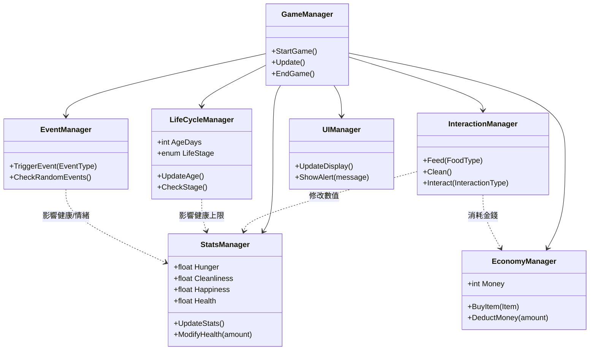
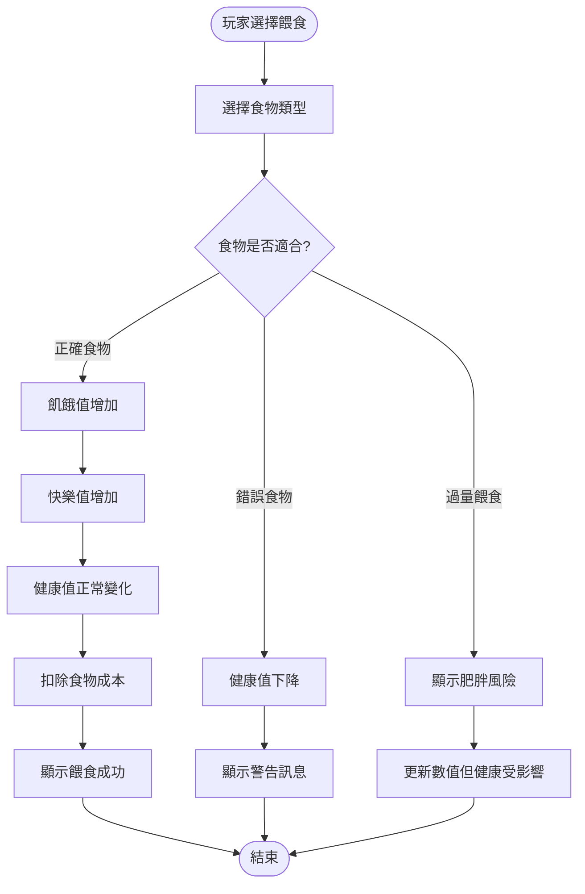
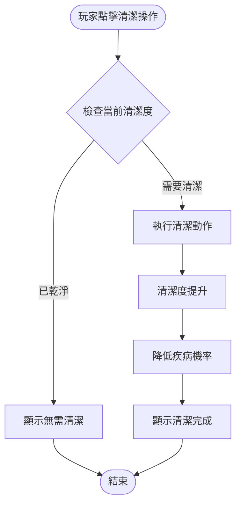
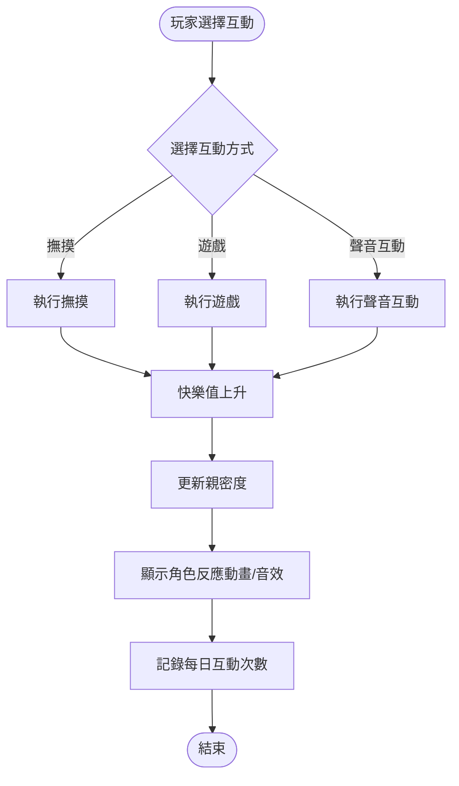
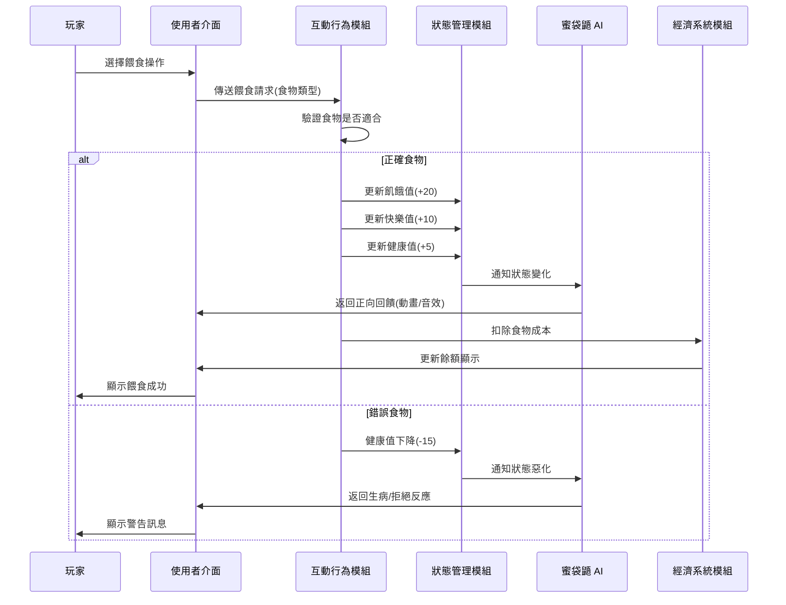
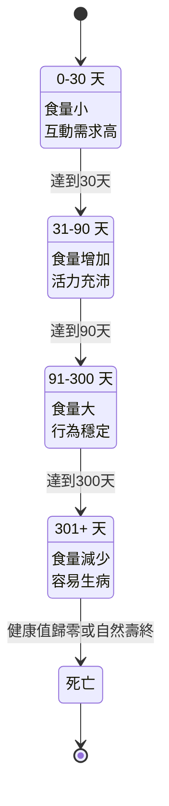
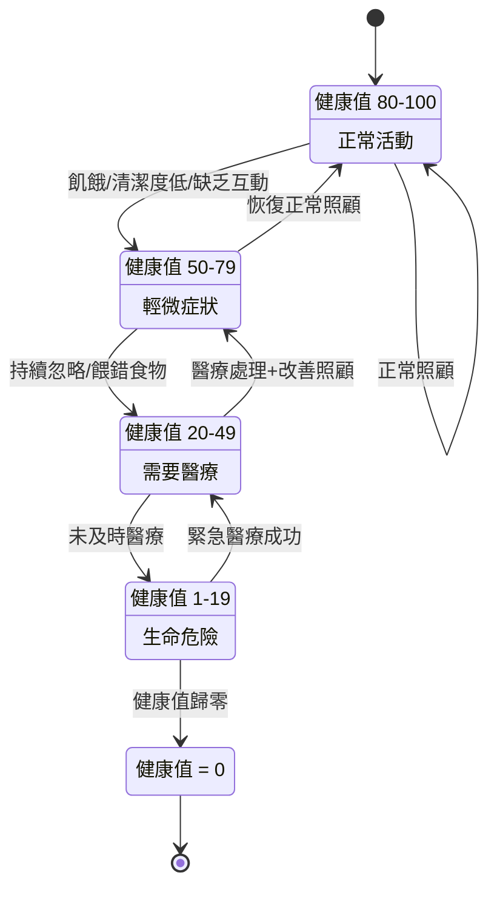

# UML 設計文件

## 1. 使用案例圖 (Use Case Diagram)

對應 User Stories (US-01 ~ US-06) 與功能需求 (FR-01 ~ FR-17)。

```mermaid
usecaseDiagram
    actor Player as "玩家 (Player)"
    actor System as "系統 (System)"

    package "蜜袋鼯飼養模擬" {
        usecase "建立角色 (FR-01)" as UC1
        usecase "餵食 (FR-02)" as UC2
        usecase "清潔籠子 (FR-03)" as UC3
        usecase "互動/撫摸 (FR-04, FR-15)" as UC4
        usecase "查看日誌 (FR-05)" as UC5
        usecase "購買物品 (FR-12, FR-13)" as UC6
        usecase "處理醫療事件 (FR-14)" as UC7
        usecase "查看回顧日誌 (FR-11)" as UC8
    }

    Player --> UC1
    Player --> UC2
    Player --> UC3
    Player --> UC4
    Player --> UC5
    Player --> UC6
    Player --> UC7
    Player --> UC8

    UC1 ..> System : 生成初始屬性
    UC2 ..> System : 更新飢餓/快樂/健康
    UC3 ..> System : 更新清潔度
    UC4 ..> System : 更新親密度/快樂
    UC6 ..> System : 扣除金錢
    UC7 ..> System : 扣除金錢/恢復健康
    UC8 ..> System : 角色死亡時生成
```

## 2. 類別圖 (Class Diagram)

對應 `SystemOverview.md` 中的 3.1 系統模組圖與 3.2 模組功能說明。



## 3. 活動圖 (Activity Diagram)

### 3.1 玩家餵食流程 (FR-02)



### 3.2 玩家清潔流程 (FR-03)



### 3.3 互動流程 (FR-04)



## 4. 循序圖 (Sequence Diagram)

### 4.1 互動與回饋流程 (FR-15, FR-16)



## 5. 狀態圖 (State Machine Diagram)

### 5.1 生命週期狀態 (FR-07, FR-08, FR-10)



### 5.2 健康狀態變化 (FR-06, FR-14, FR-17)


