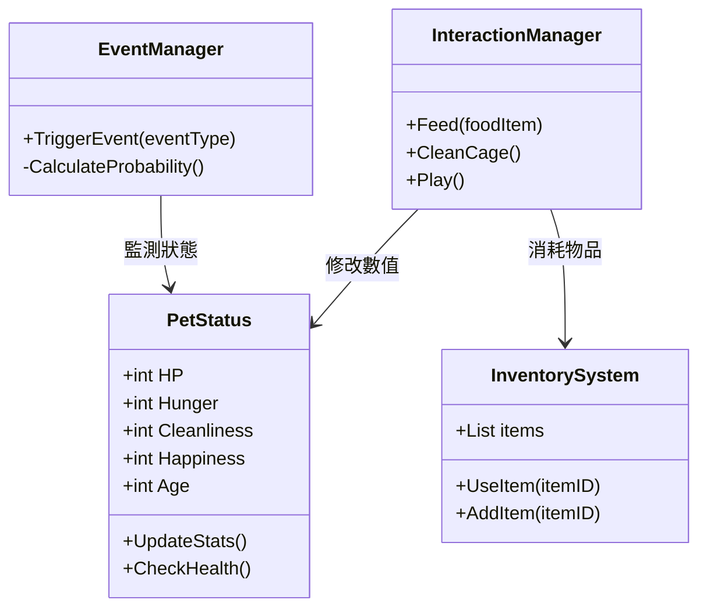
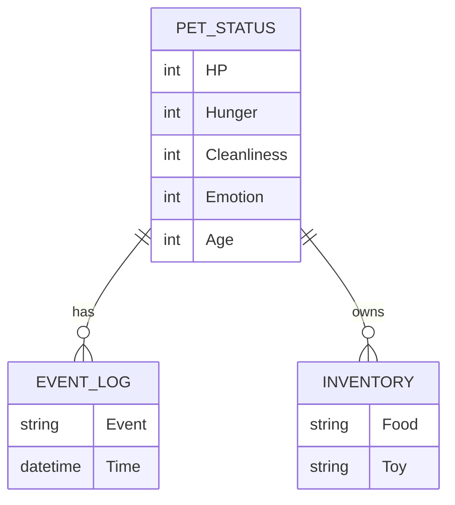

# 細部系統架構

- 健康系統
	- HP
	- 疾病
	- 營養
- 情緒系統
	- 快樂
	- 壓力
- 互動系統
	- 摸摸
	- 玩耍
- 時間系統
	- 晝夜
	- 年齡轉換
- 事件系統
	- 生病
	- 逃跑
	- 過度壓力

## 遊戲邏輯流程
1. 餵食 → 更新健康值 → 更新情緒 → 回饋動畫
2. 清潔 → 更新衛生狀態 → 減少疾病機率

## 架構圖（Mermaid）

## 資料結構設計
- pet_status (健康、飢餓、清潔、情緒、年齡)
- inventory (食物、玩具)
- event_log (事件紀錄)

## 資料結構圖（Mermaid ERD）

