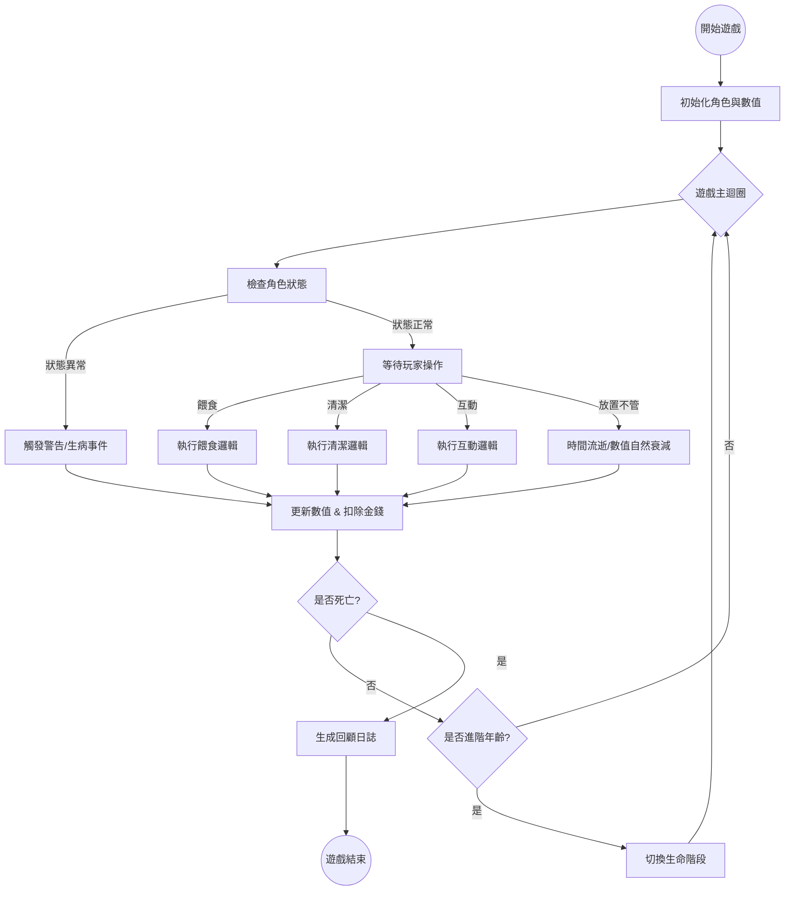

# 系統說明與高階架構 (System Overview & Architecture)

## 1. 系統說明 (System Description)

### 1.1 專案背景與目的
本專案為一款「蜜袋鼯飼養模擬遊戲」。
* **核心目的**：透過模擬真實的飼養流程，教育玩家理解生命的重要性與飼養寵物的責任感。
* **目標客群**：對蜜袋鼯有興趣的潛在飼主、喜愛養成遊戲的玩家、以及希望學習生命教育的學生。
* **預期效益**：玩家在體驗遊戲後，能了解蜜袋鼯的習性與照護困難點，避免現實中因一時衝動飼養而造成的棄養潮。

### 1.2 蜜袋鼯生物特性介紹（遊戲化基礎）
為了讓模擬具備真實性，本系統將以下生物特性轉化為遊戲機制：
* **夜行性動物**：遊戲中設定白天為睡眠時間，主要互動集中在夜間（對應遊戲內的互動時間加成）。
* **群居與怕孤獨**：轉化為「依賴度/快樂度」數值，若玩家長期不互動，角色將出現憂鬱症狀。
* **飲食需求**：蜜袋鼯需要高蛋白與鈣質，不能食用巧克力等禁忌食物。這轉化為「健康管理」與「錯誤餵食懲罰」機制。
* **壽命長**：現實中平均壽命 10-15 年。遊戲中採用「時間縮放（1天=1年）」機制來呈現完整的生老病死。

### 1.3 遊戲玩法總覽
玩家將扮演一位新手飼主，經歷以下循環：
1.  **領養階段**：初始化一隻幼年蜜袋鼯。
2.  **日常照顧**：每日進行餵食、清潔籠子、撫摸互動。
3.  **應對事件**：處理隨機發生的生病、心情低落或物資短缺事件。
4.  **生命歷程**：觀察蜜袋鼯從幼年活潑、成年穩重到老年衰退的過程。
5.  **結局回顧**：角色死亡後，系統將生成「飼養回顧日誌」，評分玩家的飼養表現。

---

## 2. 使用者故事 (User Stories)

基於上述目的，我們定義了以下核心使用者故事，作為功能開發的依據：

* **US-01 學習飼養知識**：身為一名新手玩家，我希望透過餵食和清潔的反饋，學會什麼是對蜜袋鼯有益的行為。
* **US-02 建立責任感**：身為一名飼主，我希望看到我的疏忽（如忘記清潔）會導致角色生病，讓我體驗照顧生命的責任。
* **US-03 理解長期投入**：身為一名玩家，我希望能體驗到蜜袋鼯完整的生命週期（含老年的醫療需求），理解養寵物是一輩子的承諾。
* **US-04 模擬飼養成本**：身為一名學生，我希望遊戲能呈現飼養的經濟壓力（伙食費、醫療費），讓我評估現實中是否負擔得起。

> *註：詳細功能需求 (FR) 與非功能需求 (NFR) 請參閱 `doc/requirements/FR.md` 與 `doc/requirements/NFR.md`。*

---

## 3. 初步系統架構 (High-Level System Architecture)

### 3.1 系統模組圖 (System Block Diagram)
本系統採用模組化設計，主要分為三大層級：使用者介面層、核心邏輯層、資料存取層。

```mermaid
graph TD
    User[玩家 User] --> UI[使用者介面層 UI Layer]
    
    subgraph UI Layer
        MainUI[主遊戲畫面]
        LogUI[日誌與報表介面]
        EventUI[事件與通知視窗]
    end

    UI --> Logic[核心邏輯層 Core Logic Layer]

    subgraph Core Logic Layer
        GameManager[遊戲管理器 (Game Loop)]
        
        subgraph SubSystems [子系統模組]
            StatsMgr[狀態管理模組<br>(健康/飢餓/情緒)]
            LifeCycleMgr[生命週期模組<br>(生長/老化/死亡)]
            InteractMgr[互動行為模組<br>(餵食/清潔/撫摸)]
            EconomyMgr[經濟系統模組<br>(預算/花費)]
            EventMgr[隨機事件模組<br>(生病/特殊反應)]
        end
        
        GameManager <--> SubSystems
    end

    Logic --> Data[資料存取層 Data Layer]

    subgraph Data Layer
        SaveData[存檔資料<br>(Json/PlayerPrefs)]
        ConfigData[遊戲設定參數<br>(食物數值/成長曲線)]
    end
```

### 3.2 模組功能說明

* **狀態管理模組 (Stats Manager)**：負責計算飢餓度、清潔度、快樂度與健康值的增減邏輯。
* **互動行為模組 (Interaction Manager)**：處理玩家的點擊輸入，如餵食判定、清潔判定。
* **生命週期模組 (Life Cycle Manager)**：控制時間流逝，判斷角色是否升級年齡階段或死亡。
* **經濟系統模組 (Economy Manager)**：計算飼養成本，記錄每一筆支出。
* **隨機事件模組 (Event Manager)**：根據狀態觸發「生病」、「分離焦慮」等特殊狀態。

---

## 4. 系統主流程圖 (Main System Flow)
以下展示玩家在遊戲中的主要操作循環：

